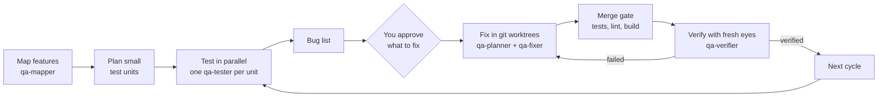

# QA Cycle: whole-app QA for Claude Code, run by a team of agents

**QA Cycle is a Claude Code plugin that tests your entire app, fixes the bugs it finds and proves each fix
works.** It maps every feature from the code, tests each one with a separate agent, hands you a bug list to
approve, fixes the approved bugs in isolated git worktrees, and has a fresh agent verify every fix. Then it
does it again, cycle after cycle, until nothing you asked to fix is left.

It works on Android, iOS, web and non-UI code (CLIs, APIs, libraries).

[](LICENSE)


## The problem it solves

Asking one AI agent to "test the app and fix what's broken" doesn't scale past a small change:

- **It runs out of attention.** One agent can't hold a whole app, so it tests the screens it happens to
  open and misses the rest.
- **It grades its own homework.** The agent that wrote a fix is the worst judge of whether it works, and
  "fixed" quietly means "compiles".
- **It forgets.** Long sessions get compacted, and the list of what was found, fixed and checked is lost.
- **It's unsafe to parallelize.** Several agents in one checkout overwrite each other's work and fight over
  ports and builds.

QA Cycle splits the work the way a real QA team does: small units, one agent each, a written record, and
someone other than the fixer signing off.

## Install

In Claude Code:

```
/plugin marketplace add DrunkenDealer/claude-code-qa-cycle
/plugin install qa-cycle@qa-cycle
```

Or from your shell: `claude plugin marketplace add DrunkenDealer/claude-code-qa-cycle`, then
`claude plugin install qa-cycle@qa-cycle`.

Then open your project and ask: **"Run a QA cycle on this app"**, or type `/qa-cycle:qa-cycle`.

## How a cycle works



1. **Map.** A read-only agent builds a feature map from the code: entry points, features, states,
   cross-feature flows and integrations.
2. **Plan.** The map is cut into small test units, each one agent's job. You see the plan.
3. **Test.** One tester agent per unit, each in its own sandbox and port range. It drives the app like a
   user and reproduces every finding twice before reporting it.
4. **List.** Findings are deduplicated and graded (blocker, major, minor). **Nothing is fixed until you
   approve the list.**
5. **Fix.** Fixes that touch state, history, concurrency or stored data get a written plan first. Each fixer
   works in its own git worktree and branch.
6. **Merge.** A script lands one branch at a time on main, behind your tests, lint and build. If anything
   fails, nothing lands.
7. **Verify.** A fresh agent that didn't write the fix checks it on the merged code: the original repro,
   close variants, every intermediate step, and earlier fixes nearby.
8. **Loop.** Failed fixes go back to planning. New bugs join the list. The next cycle re-tests the app.

## What's inside

| Component | Model | Role |
|---|---|---|
| `qa-cycle` skill | your session model | The orchestrator: plans, dispatches agents, merges, keeps the record, asks you at the gates |
| `qa-mapper` agent | Sonnet | Builds the feature map from the code (read-only) |
| `qa-tester` agent | Sonnet | Tests one unit in a sandbox and reports findings; never fixes |
| `qa-planner` agent | Opus | Writes the fix plan for risky items, and revises it after a failed verification (read-only) |
| `qa-fixer` agent | Sonnet | Implements one fix in its own worktree; stops and reports a gap rather than redesigning |
| `qa-verifier` agent | Sonnet | Adversarially re-checks one merged fix; never the agent that wrote it |
| `regression` skill | — | Verify one feature you just built: code review, tests, blast radius, platform audit |
| `manual-qa` skill | — | A tester's pass over a diff: concrete bug reports by severity |
| `scripts/` | Node.js | Tracker updates, sandboxes, the merge gate, stale-plan checks, worktree cleanup, port sweep |

Testers and verifiers judge each screen against platform checklists in `skills/regression/references/`:
Android (Material, Compose), iOS (Human Interface Guidelines), web (WCAG 2.2 AA, responsive, forms) and a
general one for non-UI code. If your project has its own UI or design-system skill, that takes precedence.

## Built-in safety

- **You decide at the gates:** before any fixing, on product questions, on trade-offs a fix introduces, and
  before each new test cycle.
- **The fixer never verifies its own fix.** An item counts as verified only when a different agent proves
  it on current main, and the tracker script records which agent did.
- **Isolation:** every fixer gets its own git worktree, and every tester and verifier its own sandbox and
  port range. Nothing touches production, shared state or real payments.
- **Commits stay local.** One concern per commit, in your git identity, with no AI trailer. QA Cycle never
  pushes.
- **Load budget:** it estimates machine load before starting each agent, and the merge gate waits while
  testers or verifiers are running.
- **A durable record:** a tracker page plus a tooling folder outside the session, so a long run survives
  context compaction and restarts.

## Data, credentials and network

- **No network calls of its own** and no MCP servers. The only outbound command is
  `git fetch origin pull/<N>/head`, run against your own repository when you ask to review a pull request.
- **No credentials are read.** `secrets` in `qa.config.json` is a deny-list: the generated agent rules forbid
  reading those files. `signin` is an optional command you supply to sign a test user into your local dev
  server. `mkbox` writes a test-only `.env` into a throwaway sandbox.
- **Local files only.** The tracker, plans and agent notes stay in your tooling folder. `boundary.mjs` reads
  the memory files you list under `handoffMemory`, read-only.
- **Permissions:** the skills pre-approve only read-only tools, starting agents and asking you questions.
  Shell commands and file edits go through your normal Claude Code permission prompts.

## When to use which

| You want to… | Use |
|---|---|
| Test the whole app, then fix and re-verify in cycles | `/qa-cycle:qa-cycle` |
| Check one feature you just built before shipping | `/qa-cycle:regression` |
| Get a tester's bug list for a diff or PR | `/qa-cycle:manual-qa` |

## Set up a project

The orchestrator walks you through this on the first run. To do it yourself:

1. Create a tooling folder outside the repo, for example `~/.claude/projects/<project>/qa-fix/`.
2. Symlink the scripts into it, then copy and fill in the config:

   ```sh
   SKILL=<path to the installed plugin>/skills/qa-cycle
   cd <tooling>
   for f in $SKILL/scripts/*.mjs $SKILL/scripts/*.sh; do ln -sf "$(realpath "$f")" "$(basename "$f")"; done
   cp $SKILL/scripts/qa.config.example.json qa.config.json
   ```

   `qa.config.json` holds your repo path, test, lint and build commands, port ranges, and what must never be
   touched (production servers, secrets, paid services).
3. Generate the agents' rule files with `node mkrules.mjs`, which writes `FIXRULES.md` and
   `VERIFYRULES.md`.
4. Add `.claude/worktrees/` to your project's `.gitignore`.

The sandbox script (`mkbox`) and the generated rules fit web and server projects best. For mobile apps, write
`FIXRULES.md` and `VERIFYRULES.md` by hand from the templates in `references/`, and point testers at your
emulator or simulator.

## Requirements and cost

- Claude Code, with git and Node.js 18 or later, on macOS or Linux.
- **It uses a lot of tokens.** A cycle starts dozens of agents. Executors default to Sonnet and only the
  planner uses Opus. Start with one area of the app to see what a cycle costs you.
- It works best with a test suite and a build command, so the merge gate has something to enforce.

## Used in production

QA Cycle was built while running it on a Kotlin Multiplatform app (Android and iOS) and a web app. Over
several cycles it tracked 200+ findings. On the mobile app, the first cycle found 4 blockers and 51 majors,
fixed in 141 small local commits, each one verified by a separate agent.

## FAQ

**Does it push code or open pull requests?** No. Everything stays in local commits for you to review and
push.

**Can I run only part of it?** Yes: `/qa-cycle:qa-cycle map`, `test`, `fix`, `verify` or `status`, optionally
with item IDs.

**Does it work in Claude Cowork or on claude.ai?** No. It needs Claude Code's subagents, git worktrees and
shell access.

**What if a fix makes something else worse?** The verifier reports it as a residual trade-off, and you decide
at the next gate whether to accept it or fix it.

## Contributing

Issues and pull requests are welcome. Please describe the project type (Android, iOS, web, other) and
include the tracker item or agent report that showed the problem.

## License

[MIT](LICENSE) © Max Shwed
